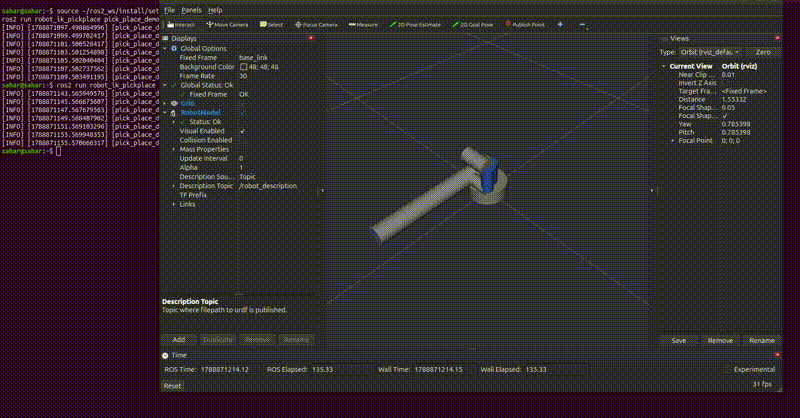

# robot_ik_pickplace

A from-scratch inverse kinematics solver and simulated pick-and-place
controller for a 6-DOF arm, built in Python and wired into ROS2.

**Why this project exists:** I spent 5 years programming ABB and KUKA
robots (RAPID/KRL) for pick-and-place and welding cells, using each
vendor's built-in kinematics solver and motion instructions. This project
reimplements that same kind of task — move to a pose, grasp, move to
another pose — but with the forward/inverse kinematics, the Jacobian, and
the motion sequencing all written from scratch in Python, wrapped in a
ROS2 node instead of a vendor teach-pendant program.



## What's in here

- `robot_ik_pickplace/kinematics.py` — DH-parameter forward kinematics, a
  geometric Jacobian, and a damped least-squares numerical IK solver. Pure
  Python/NumPy, no ROS2 dependency.
- `standalone_demo/demo_no_ros.py` — runs the kinematics with no ROS2
  install required. **Start here.**
- `test/test_kinematics.py` — pytest unit tests (FK determinism, valid
  transform structure, IK convergence, FK→IK round-trip, Jacobian shape).
- `robot_ik_pickplace/ik_node.py` — ROS2 node: subscribes to
  `geometry_msgs/PoseStamped` on `target_pose`, publishes
  `sensor_msgs/JointState` on `joint_states`.
- `robot_ik_pickplace/pick_place_demo.py` — publishes a scripted
  pick-and-place waypoint sequence.
- `urdf/six_axis_arm.urdf` — arm model derived from the same DH
  parameters as `kinematics.py` (verified to match numerically).
- `launch/ik_demo.launch.py` — starts `robot_state_publisher`, `ik_node`,
  and RViz2 together.

## Quick start (no ROS2 needed)

```bash
cd standalone_demo
python3 demo_no_ros.py
python3 -m pytest ../test/test_kinematics.py -v
```

## Full ROS2 demo

```bash
colcon build --packages-select robot_ik_pickplace
source install/setup.bash

# terminal 1
ros2 launch robot_ik_pickplace ik_demo.launch.py
# terminal 2
ros2 run robot_ik_pickplace pick_place_demo
```

In RViz2, add a `RobotModel` display (topic: `robot_description`) and a
`TF` display to watch the arm move.

## What to build next

Swap in a real robot's URDF (e.g. `ur_description` for a UR5) and update
`DEFAULT_DH_TABLE` to match · add Gazebo for real physics · compare
against MoveIt2's IK/planning stack · port the solver to C++ (`rclcpp`)
· write an analytical IK solver for this geometry.

## Notes

The DH parameters here are illustrative, not a specific commercial
robot's — this demonstrates the kinematics/IK/ROS2 pipeline itself. The
URDF's joint origins were derived by hand from the DH table (each joint
axis is `z`; each origin encodes the previous row's `d, a, alpha`) and
verified numerically to reproduce `kinematics.py`'s FK output exactly.
